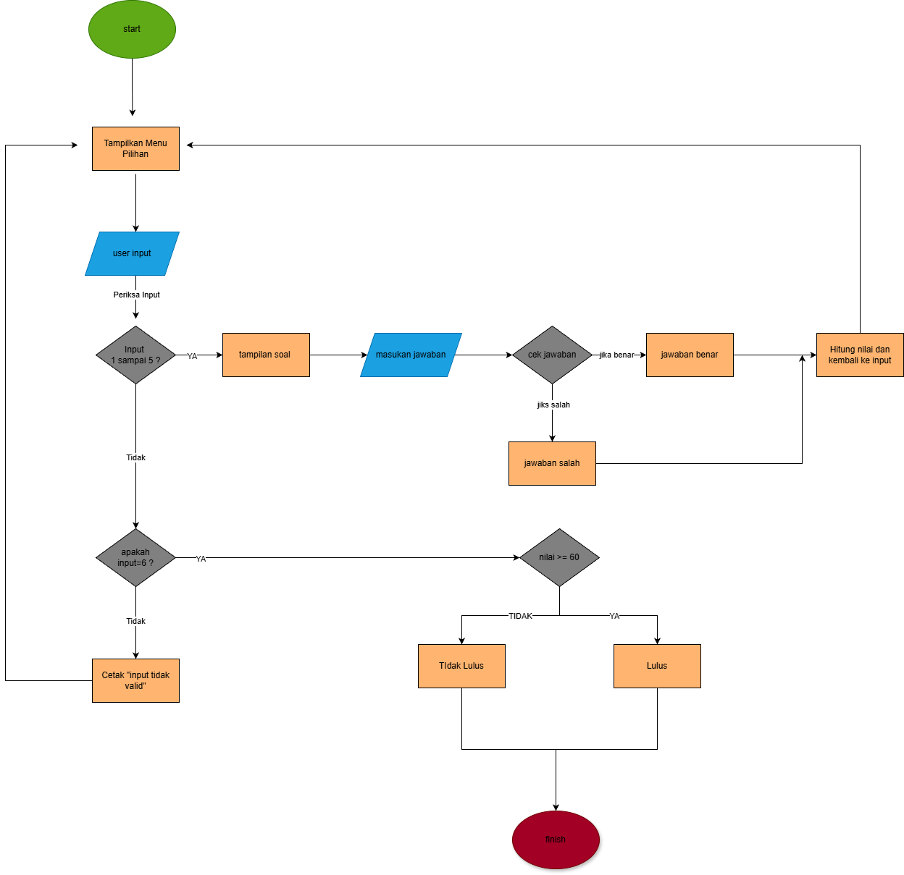

# 📝 Aplikasi Quiz EPrT (Go)

Aplikasi **Quiz berbasis Command Line Interface (CLI)** yang dibuat menggunakan **bahasa pemrograman Go (Golang)**.
Aplikasi ini memungkinkan pengguna menjawab beberapa soal, menghitung skor secara otomatis, dan menentukan hasil **Lulus / Tidak Lulus** berdasarkan nilai akhir.

---

## 📌 Fitur

* Menu quiz berbasis input pengguna
* 5 soal dengan berbagai jenis pertanyaan
* Pemeriksaan jawaban benar atau salah
* Perhitungan skor otomatis
* Evaluasi kelulusan
* Implementasi logika berdasarkan flowchart

---

## 📊 Gambaran Flowchart

Alur program dijalankan sebagai berikut:

1. Program dimulai (Start)
2. Pengguna memilih menu (1–5 untuk soal, 6 untuk keluar)
3. Program menampilkan soal
4. Pengguna memasukkan jawaban
5. Sistem memeriksa jawaban
6. Skor dihitung
7. Evaluasi hasil (Lulus / Tidak Lulus)
8. Program selesai (Finish)



---

## 🧠 Kriteria Kelulusan

* **Jumlah soal:** 5
* **Nilai per soal benar:** 20 poin
* **Nilai minimum lulus:** ≥ 60
* **Nilai maksimum:** 100

| Nilai                                  |
| -------------------------------------- |
| ≧60 = LULUS <60 =  TIDAK LULUS |

---

## 🛠️ Teknologi yang Digunakan

* **Bahasa Pemrograman:** Go (Golang)
* **Input / Output:** CLI (`fmt`)
* **Struktur Kontrol:** Perulangan dan percabangan
* **Tipe Data:** `int`, `string`, `bool`, `float64`

---

## ▶️ Cara Menjalankan Program

1. Pastikan Go sudah terinstall
   👉 [https://go.dev/dl/](https://go.dev/dl/)

2. Clone repository ini:

   ```bash
   https://github.com/kilowavw/TesEPRT.git
   ```

3. Masuk ke folder project:

   ```bash
   cd TesEPRT
   ```

4. Jalankan program:

   ```bash
   go run Tubes.go
   ```

---

## 📁 Struktur Folder

```
TesEPrT/
│
├── main.go        # Source code utama
├── README.md      # Dokumentasi project
└── flowchart.png  # Diagram alur program
```

---

## 🧪 Contoh Tampilan Program

```
Tes Quiz
Silahkan Pilih Menu:
1. Soal 1
2. Soal 2
3. Soal 3
4. Soal 4
5. Soal 5
6. Keluar
```

---

## 🎯 Tujuan Pembelajaran

* Memahami dasar bahasa Go
* Mengimplementasikan logika percabangan
* Menggunakan perulangan dengan benar
* Menerjemahkan flowchart ke dalam kode
* Mengelola input pengguna pada aplikasi CLI

---

## 👤 Pembuat

**Raka Satria Hafiz**

**MUHAMMAD FAKHRY AL GUSRA**

---
